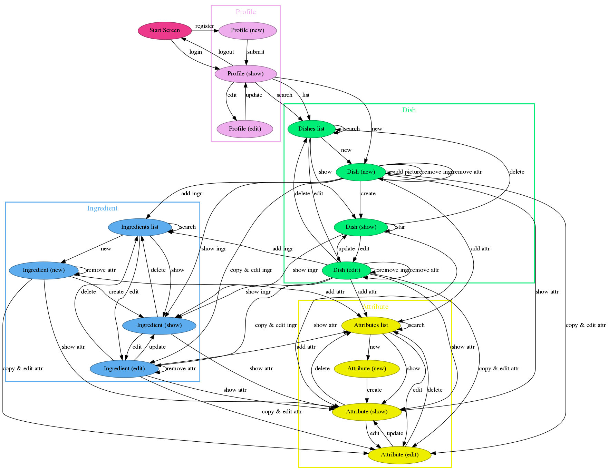

# Analysis

## Problem Interaction

### Navigation

*The navigation defines the main user interactions: those which
triggers navigation inside the application, i.e. how the
end-user should use it in order to change environments and to access its
features.*

The following diagram defines the main navigation flow, by defining:

- **The Screens** (*ellipses*): these are the main views the
  user interacts with:
  Here we don't consider small views or details.
  Even *how* those screens are implemented will be specific to
  the particular device and technology chosen.

- **The Main Actions** that can be taken (*arrows*): An arrows triggers
  a transition from a view to another (possibly the same) view. 
  Here we don't consider small actions or interactions but only the
  macro interactions: those which usually trigger screen changes.

