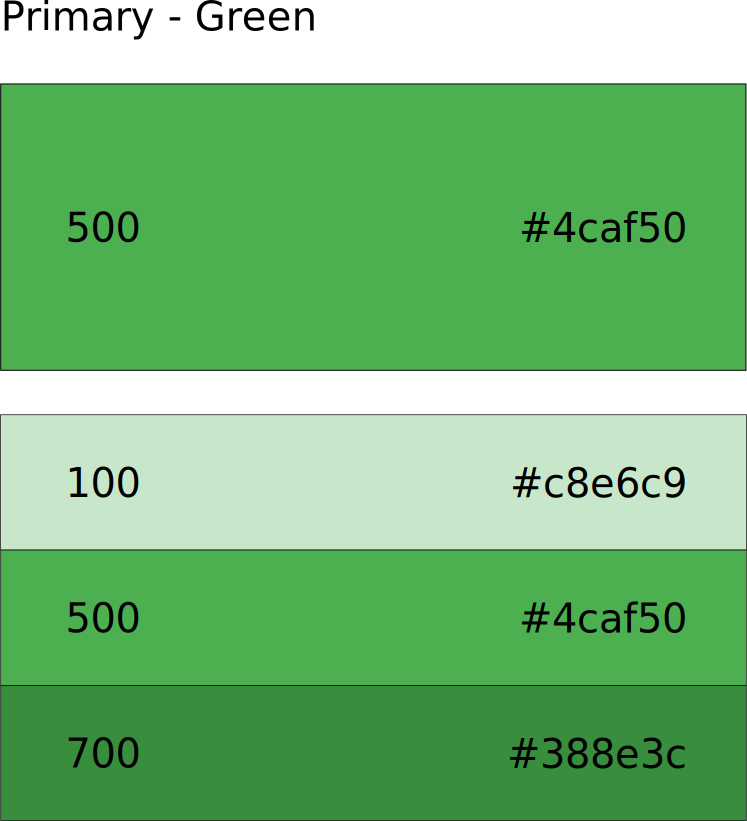
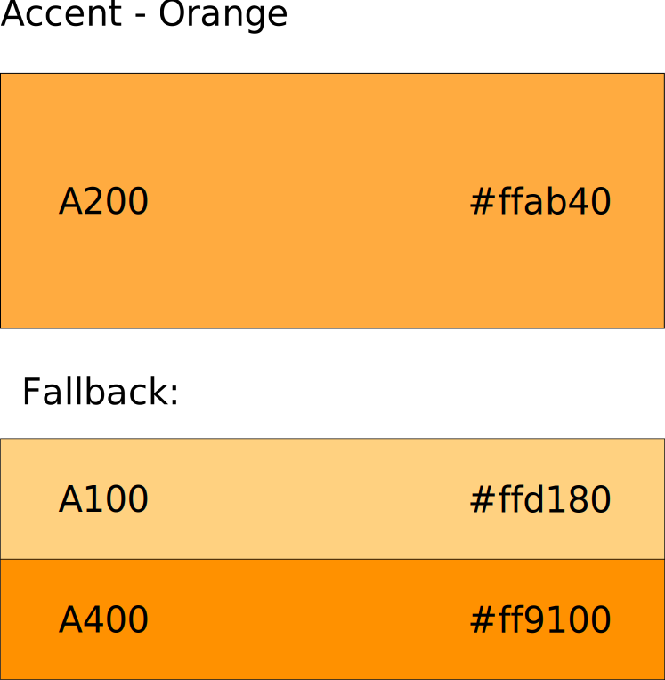

# Android design

## Vision

The UI follows:

- [Google Material UI design](https://www.google.com/design/spec/material-design/introduction.html)
- [Google app structure patterns](https://www.google.com/design/spec/patterns/app-structure.html)

### Material UI principles

**We'll try to follow the Material UI principles as much as possible.**

#### Material is the metaphor

- A material metaphor is the unifying theory of a rationalized space and a
  *system of motion*. The material is grounded in tactile reality, inspired by
  the study of paper and ink, yet technologically advanced and open to
  imagination and magic.

- Surfaces and edges of the material provide visual cues that are grounded in
  reality. *The use of familiar tactile attributes helps users quickly understand
  affordances*. Yet the flexibility of the material creates new affordances that
  supercede those in the physical world,  without breaking the rules of physics.

- The fundamentals of *light, surface, and movement are key to conveying how
  objects move, interact, and exist in space and in relation to each other*.
  Realistic lighting shows seams, divides space, and indicates moving parts.

#### Bold, graphic, intentional

- The foundational elements of *print-based design-typography, grids, space,
  scale, color, and use of imagery-guide visual treatments*. These elements do
  far more than please the eye. They create hierarchy, meaning, and focus.
  Deliberate color choices, edge-to-edge imagery, large-scale typography, and
  intentional white space create a bold and graphic interface that immerse the
  user in the experience.

- An emphasis on user actions makes core functionality immediately apparent and
  provides waypoints for the user.

#### Motion provides meaning

- Motion respects and reinforces the user as the prime mover. Primary user
  actions are inflection points that initiate motion, transforming the whole
  design.

- All action takes place in a single environment. Objects are presented to the
  user *without breaking the continuity of experience even as they transform
  and reorganize*.

- Motion is *meaningful* and appropriate, serving to focus attention and
  maintain continuity. Feedback is subtle yet clear.
  Transitions are efficient yet *coherent*.

### Material UI colors

The colors used are compliant with the [Google Material UI color palette](http://www.google.it/design/spec/style/color.html#color-color-palette).

This involves [using the material theme](http://developer.android.com/training/material/theme.html#ColorPalette).

The colors chosen are:

- Green as Primary.
- Orange as Accent.

This leads to the following color palettes:

### Material UI typography

The typography follows the [Google Material UI typography guidelines](http://www.google.it/design/spec/style/typography.html).

In particular the `Roboto` font will be used.
